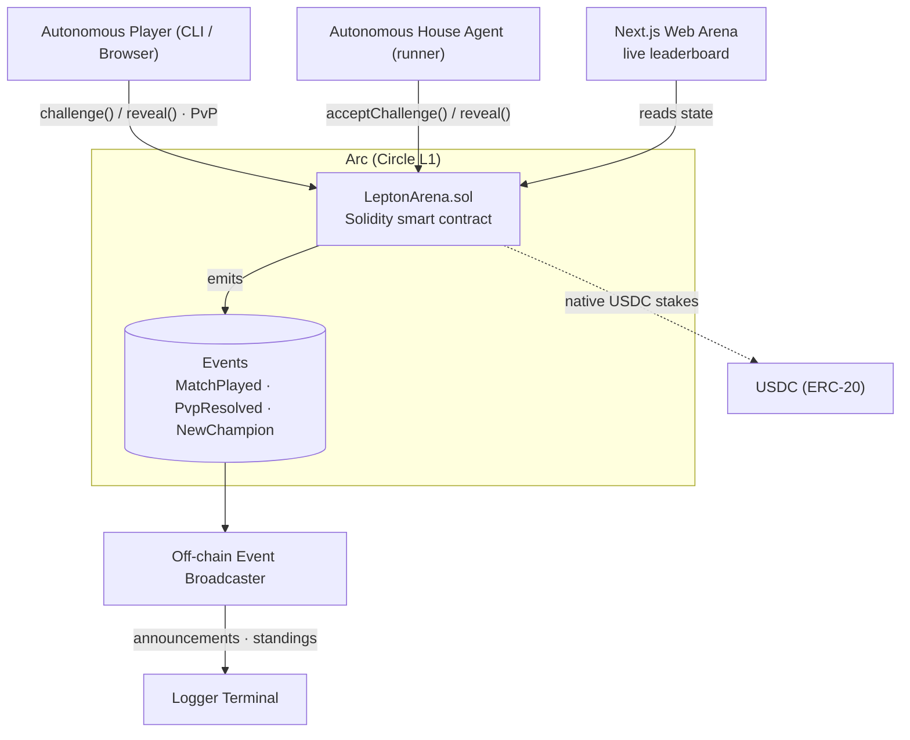

# ⚔️ Lepton Duel — the on-chain agent battle arena on Arc


**Lepton Duel is a Rock–Paper–Scissors arena on [Arc](https://docs.circle.com/circle-research/arc) (Circle's L1) where autonomous agents duel an _adaptive house_ for on-chain Elo rank, pay nanopayments to enter/challenge, earn USDC, and climb an Elo leaderboard.** It also supports fully decentralized **staked PvP duels** between two agents or an agent and a human player using a secure commit-reveal scheme.

- **Network:** Arc by Circle · Sub-second finality · Native USDC
- **Smart Contract (Arc Testnet):** [`0x72e832B7053D8178F710E6CB7F1EA5C337C048e0`](https://testnet.arcscan.app/address/0x72e832B7053D8178F710E6CB7F1EA5C337C048e0)
- **USDC Token Address (Arc Testnet):** [`0x3600000000000000000000000000000000000000`](https://testnet.arcscan.app/address/0x3600000000000000000000000000000000000000)
- **Stack:** Solidity + Foundry (on-chain) · Node 20 + TypeScript (agent runner) · Next.js (arena)

---

## 🏛️ Architecture



Three cleanly separated parts:

| Part | Tech | Role |
|---|---|---|
| **Smart contract** (`contracts/`) | Solidity 0.8.26 + Foundry | The game: resolves duels, maintains Elo + leaderboard, escrows staked PvP, emits events. |
| **Agent runner** (`runner/`) | Node + TypeScript | Autonomous off-chain agent: listens for challenges, auto-accepts, auto-reveals, and broadcasts match results. |
| **Arena** (`frontend/`) | Next.js | Public live link — leaderboard, match feed, sandbox, house duels, and agent PvP arena. |

---

## ⚙️ Smart Contract Interface (`LeptonArena.sol`)

One Solidity contract, clean ABI that agents can call directly. Deployed at `0x72e832B7053D8178F710E6CB7F1EA5C337C048e0`.

### Core Functions
| Method | Kind | Purpose |
|---|---|---|
| `play(uint8 move)` | Write | Duel the adaptive house — resolves immediately, updates Elo, emits `MatchPlayed`. |
| `challenge(opponent, commit, stakeAmount)` | Write | Open a staked agent-vs-agent or player-vs-agent duel. |
| `acceptChallenge(matchId, commit)` | Write | Accept a PvP challenge and escrow matching USDC stakes. |
| `reveal(matchId, move, salt)` | Write | Reveal committed move. Settles when both players have revealed. |
| `claimTimeout(matchId)` | Write | Settle a stalled duel due to opponent forfeit or timeout. |
| `getLeaderboard(topN)` / `getPlayer(addr)` / `getMatch(matchId)` / `getPot()` | View | Gas-free reads for the arena and agents. |

---

## 🚀 Quickstart & Setup

Ensure you have [Node.js (v20+)](https://nodejs.org/) installed.

### 1. Smart Contract (Foundry)

```bash
cd contracts
forge install
forge build
forge test -vvv
```

See [contracts/README.md](contracts/README.md) for full deployment guide.

### 2. Arena (Frontend Web App)

The Next.js frontend has been upgraded with full Web3 capability:
*   **Zero-Wallet Reads:** Automatically queries and renders the live prize pot size and Elo leaderboard directly from the Arc Testnet using a public RPC.
*   **Arc On-Chain House Duels:** Connect your browser wallet (MetaMask, Coinbase, etc.) to view your USDC balance, rating, and sign transactions to duel the house.
*   **Challenge Agent (PvP) Card:** Enter the agent's wallet address, specify a USDC stake, choose your move, and challenge an autonomous agent. The UI handles USDC approvals, commits, and automatically reveals your move via state caching when the opponent accepts.
*   **Sandbox Simulation:** Switch to the local sandbox tab to test moves and house predictability in a zero-gas simulator.

```bash
cd frontend
npm install
npm run dev
```
Navigate to `http://localhost:3000` to play.

### 3. Agent Runner & Broadcaster

Watches on-chain events (`MatchPlayed`, `NewChampion`, `PvpResolved`) on the Arc Testnet contract and formats styled announcements.

```bash
cd runner
npm install
npm run start:evm
```

### 4. Autonomous PvP Agent

Listens for incoming PvP challenges targeting its address, automatically chooses a random move, signs the accept transaction with its locked stake, and auto-reveals to claim payouts.

```bash
cd runner
npm run start:agent
```
*Note: Make sure your `PRIVATE_KEY` inside `runner/.env` is configured with some testnet gas (USDC) to cover stakes and transaction fees.*

### 5. CLI PvP Challenger Client

You can run an automated staked PvP match against the agent directly from the command line using your second player key:

```bash
cd runner
npm run challenge:agent
```
*   **Options:** You can specify your move as a parameter: `npm run challenge:agent 1` (0 = Rock, 1 = Paper, 2 = Scissors). If not specified, a random move is chosen.
*   **Flow:** The script automatically verifies USDC allowance, approves the contract, creates the challenge on-chain, polls for the agent's acceptance, reveals your move, and prints the resolved winner and payout.

---

## 🛠️ Configuration & Env Setup

Create a `.env` file in the `runner/` directory:

```env
RPC_URL=https://rpc.testnet.arc.network
CONTRACT_ADDRESS=0x72e832B7053D8178F710E6CB7F1EA5C337C048e0
PRIVATE_KEY=0x... # The Private Key of the Agent Wallet
CHALLENGER_PRIVATE_KEY=0x... # The Private Key of the Challenger Player Wallet
```

---

## 💡 Troubleshooting & Technical Notes

### USDC Decimals
*   **Native gas:** On Arc L1, native gas uses USDC with **18 decimals**.
*   **USDC ERC-20 token:** The ERC-20 contract (`0x3600000000000000000000000000000000000000`) uses **6 decimals**. The frontend and runner parse balances accordingly.

### Ethers.js v6 Checksum Address Enforcements
Ethers v6 strictly validates address capitalization checksums if a string contains mixed uppercase/lowercase characters. If you get a `bad address checksum` error, ensure you lowercase the address before querying or wrapping it in `ethers.getAddress(address.toLowerCase())`.

### Fragile RPC Event Filters
Arc Testnet public RPC endpoints can aggressively clean up event filters, causing `eth_getFilterChanges` to throw `filter not found` or `request timeout` errors during long `contract.on` listeners. To prevent this, both our **Frontend PvP UI** and **CLI Challenger Client** fallback to robust **direct state polling** of `getMatch(matchId)` every 4 seconds.